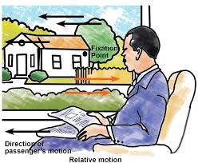

# Misalignment-eliminated warping image stitching method with grid-based motion statistics matching

## Juntar imagens é difícil

- Mundo é 3D e as câmeras capturam apenas projeções 2D dele
- A ideiza principal é simples, tu cola as fotos com campos de visão limitados para criar uma única imagem panorâmica perfeita. No entanto, a tradução da realidade 3D para a representação 2D carrega imperfeições

## Distorção Radial

- Lentes fotográficas, especialmente as grandes angulares, distorcem geometricamente a imagem. 
- Barrel distortion (efeito barril): as linhas retas do mundo real aparecem curvadas nas bordas da imagem, como se a foto estivesse impressa numa bola. Isso significa que dois pixels vizinhos na borda da foto não correspondem a dois pontos igualmente vizinhos na realidade.

## Paralaxe

- Paralaxe é o fenômeno pelo qual objetos a distâncias diferentes do observador parecem se deslocar em velocidades diferentes quando o observador se move.



- O exemplo clássico: olhe pela janela de um trem em movimento. As árvores próximas parecem voar para trás rapidamente, enquanto as montanhas ao fundo mal se movem. Isso acontece porque a relação angular entre o observador e um objeto depende da distância.

- Na fotografia panorâmica, isso significa que ao girar a câmera, objetos próximos "saltam" de posição de uma foto para a outra de forma desproporcional aos objetos distantes. O resultado é que **não existe uma única transformação matemática simples que consiga alinhar simultaneamente todos os objetos da cena** — a paralaxe torna o encaixe perfeito matematicamente impossível em fotografias comuns.

## Matching

- Antes de qualquer correção, o computador precisa entender onde as fotos se sobrepõem e como elas se relacionam. Ele faz isso procurando pontos correspondentes entre as imagens — o mesmo objeto físico aparecendo nas duas fotos.
O processo tem dois estágios:
1. Detecção de features (características): O algoritmo varre cada imagem procurando regiões visualmente distintas — cantos, bordas marcantes, texturas únicas. Esses pontos são chamados de keypoints ou features. Pense neles como estrelas num mapa celeste: pontos de referência únicos o suficiente para serem reconhecidos.
2. Matching (correspondência): O algoritmo tenta parear cada feature de uma imagem com sua feature correspondente na outra. O desafio é que muitos pares encontrados são falsos positivos — o algoritmo acha que dois pontos correspondem, mas está errado. Esses erros corrompem todo o cálculo subsequente.
O artigo propõe usar uma combinação chamada ORB + GMS para fazer esse matching com muito mais precisão. Vamos entender cada um. 

### ORB (Oriented FAST and Rotated BRIEF)
- ORB é um detector de features. Ele identifica pontos-chave na imagem que são:
    - Rápidos de calcular (projetado para eficiência computacional)
    - Invariantes à rotação — o mesmo ponto é reconhecido mesmo se a câmera estiver ligeiramente inclinada
    - Robustos a variações de iluminação

- O nome vem das técnicas que combina: FAST para detectar os pontos, e BRIEF para descrevê-los matematicamente de forma compacta.

### GMS (Grid-based Motion Statistics)
- GMS é a grande inovação no estágio de matching. Em vez de avaliar cada par de pontos de forma isolada (o que gera muitos falsos positivos), o GMS adota uma lógica estatística coletiva:
    - A imagem é dividida em uma grade de células. Para cada match candidato, o GMS verifica se os pontos vizinhos desse candidato também apontam na mesma direção de movimento. Se um grupo inteiro de pontos de uma mesma célula da grade se move coerentemente para a mesma região da outra imagem, isso é uma forte evidência estatística de que os matches são verdadeiros.
    - É como a diferença entre confiar na palavra de uma pessoa solitária versus confiar num grupo de testemunhas que, sem se comunicar, deram exatamente o mesmo depoimento. A coerência do grupo elimina os falsos positivos.

## A Solução: Warping
- Com os pontos correspondentes identificados, o próximo passo é deformar uma das imagens para que ela se encaixe na outra. Esse processo de deformação calculada se chama warping.
- A metáfora perfeita do material é imaginar a foto impressa numa folha de borracha: o warping é o processo de esticar e comprimir essa borracha digitalmente até que os pontos de referência (features correspondentes) se alinhem.

### Homografia Global

- A abordagem mais simples é a homografia global: uma única equação matemática (uma matriz 3x3 de transformação projetiva) que é aplicada à imagem inteira de uma vez. Ela pode representar rotações, translações, escalonamento e perspectiva.

- O problema? Uma única equação não consegue descrever simultaneamente o comportamento de objetos em diferentes profundidades quando há paralaxe. Com paralaxe, cada região da imagem precisaria de uma transformação ligeiramente diferente. A homografia global falha miseravelmente nesses casos, produzindo o chamado ghosting.

### Homografia Local

- A solução mais sofisticada é dividir a imagem em uma grade de pequenas células (centenas de quadradinhos), e calcular uma homografia independente para cada célula. Cada pequeno pedaço da imagem tem sua própria regra de deformação local, permitindo que a imagem se curve e dobre de formas complexas para acomodar as variações de paralaxe.

- Isso é muito superior à homografia global, mas ainda pode deixar pequenos erros nas bordas entre as células adjacentes, onde as homografias locais "costuram" umas com as outras.

## O Efeito Ghosting
- O ghosting (efeito fantasma) é a manifestação visual dos erros de alinhamento. Quando o warping não consegue alinhar perfeitamente as imagens, os objetos aparecem duplicados ou com bordas borradas na imagem final — como uma sobreposição de fantasmas da mesma estrutura em posições ligeiramente diferentes. É o sinal mais claro de que o método falhou.

## A Arquitetura Proposta: Três Passos em Série
- O método do artigo combina as técnicas descritas em um pipeline de três estágios:

### Passo 1 — ORB + GMS (Encontrar os Melhores Pontos)
- Usando a combinação coarse-to-fine (do grosseiro ao fino) de ORB para detectar features e GMS para filtrá-las estatisticamente pela grade, o método obtém um conjunto de inliers (pontos correspondentes confiáveis) muito maior e mais preciso do que os métodos anteriores. Mais inliers confiáveis = melhor matéria-prima para o warping.

### Passo 2 — Homografia Local com Restrição de Similaridade Global
- Com os pontos confiáveis, aplica-se a homografia local (grade de transformações). O detalhe importante é que uma restrição de similaridade global é adicionada ao cálculo. Isso funciona como uma âncora: enquanto as células locais podem se deformar para corrigir detalhes de paralaxe, a restrição global garante que a imagem inteira não perca sua estrutura geral — horizontes continuam retos, prédios continuam ortogonais, a perspectiva geral se mantém natural.

### Passo 3 — Correção TPS (Thin Plate Spline)
- Este é o estágio mais original e sofisticado. Após o alinhamento inicial pela homografia local, ainda podem restar pequenos erros residuais de projeção — fantasmas microscópicos. Para eliminá-los, aplica-se uma correção final baseada em Thin Plate Spline (TPS).
- TPS é uma técnica matemática inspirada na física de uma chapa de metal fina e flexível. Se você fixar alguns pontos de uma chapa metálica flexível e dobrar os outros, ela se deforma suavemente, distribuindo a curvatura de forma natural e contínua — sem dobras bruscas.
- Aplicado ao problema de imagem: o TPS recebe os erros residuais de projeção (onde ainda há pequenos desalinhamentos) como pontos de controle e deforma a imagem localmente para forçar o encaixe exato nesses pontos, enquanto as regiões sem erro permanecem praticamente intocadas. É uma cirurgia milimétrica que opera só onde necessário.

## O Pipeline Completo

```
Imagens brutas (com paralaxe)
        ↓
   ORB + GMS → matches confiáveis
        ↓
Homografia Local + Restrição Global → alinhamento inicial
        ↓
   Pós-processamento TPS → correção de fantasmas residuais
        ↓
   Panorama preciso e natural
```

## Limitações Reconhecidas
- Alto custo computacional: o cálculo exaustivo do GMS somado à deformação não-rígida pixel a pixel do TPS exige processamento intensivo. Não é um método leve.
- Inadequado para tempo real: por priorizar a máxima precisão, o método não é viável para aplicações de alta taxa de quadros por segundo, como streaming de drones ao vivo.
- Falhas em oclusão severa: quando uma estrutura-chave está completamente oculta em um dos quadros (por um objeto que passou na frente, por exemplo), o algoritmo perde os pontos de ancoragem e o alinhamento inicial falha.

## Síntese Conceitual

- A contribuição central do artigo pode ser resumida assim: os métodos anteriores falhavam porque ou o matching era impreciso (gerando pontos de controle ruins para o warping) ou a deformação era insuficientemente flexível (não conseguindo acomodar toda a complexidade da paralaxe local).
- Este método ataca os dois problemas simultaneamente — melhor entrada de dados via GMS e melhor capacidade de correção via TPS — obtendo imagens que são ao mesmo tempo precisamente alinhadas e visualmente naturais.

---
---

# Image Mosaicing: A Deeper Insight

## O que é Image Mosaicing?

- Forma eficaz de construir uma única imagem sem costuras, alinhando múltiplas imagens parcialmente sobrepostas
- Abrange uma família enorme de problemas: vai desde panoramas com milhares de imagens sobrepostas até edição e composição a partir de imagens que **nem se sobrepõem**
- Aplicações: imageamento por satélite, imagens médicas, realidade virtual, edição de imagens, biometria, vigilância subaquática, entre outras

## Dois Requisitos para Boa Qualidade

1. **Alinhamento preciso:** deve haver similaridade geométrica entre as imagens de entrada e o mosaico gerado
2. **Transição suave:** a região de transição entre as imagens mosaicadas deve ser suave e ter mínima diferença fotométrica

## Os Três Passos Fundamentais

1. **Image Registration** — encontrar a relação geométrica entre as imagens
2. **Image Warping/Reprojection** — deformar e reprojetar as imagens numa superfície comum
3. **Image Blending** — mesclar as imagens eliminando costuras e artefatos visuais

## Passo 1 — Registro de Imagem

### Métodos Diretos

- Usam as **intensidades dos pixels** para alinhar as imagens, minimizando discrepâncias de intensidade globalmente
- Três variantes principais:
  - **Minimização de diferença de intensidade:** move uma imagem sobre a outra até que a diferença na sobreposição seja mínima; adequado principalmente para translação pura
  - **Correlação de fase:** a informação de deslocamento entre duas imagens reside na fase do espectro cruzado de potência; produz um pico nítido e distinto no ponto de sobreposição, ao contrário da correlação cruzada
  - **Informação mútua (MI):** quanto maior o valor de MI, melhor o alinhamento; robusta a oclusão e variações de iluminação, porém requer maior sobreposição e é computacionalmente mais lenta
- **Limitação geral:** não são robustos a variações de iluminação; objetos em movimento criam problemas pois todos os pixels são considerados

### Métodos Baseados em Features

- Extraem características distintas das imagens e as emparelham para estimar o mapeamento imagem-a-imagem
- Mais populares que os métodos diretos devido à robustez

#### Harris Corner Detection
- Detecta cantos e bordas com base na função de autocorrelação local
- A resposta R classifica cada ponto: **valores positivos** → cantos, **valores negativos** → bordas, **valores pequenos** → regiões planas

#### SIFT (Scale Invariant Feature Transform)
- Features altamente distintas, invariantes ao escalonamento, rotação, distorção afim, ruído e mudanças de iluminação
- Quatro etapas: detecção de extremos no espaço de escala (DoG) → seleção de keypoints estáveis → atribuição de orientação dominante → criação de descritor vetorial de **128 dimensões**

#### SURF (Speeded Up Robust Features)
- Aumenta significativamente a velocidade de matching usando aproximação da matriz Hessiana
- Gera descritor de **64 dimensões** (metade do SIFT) — mais rápido com performance comparável

#### ORB (Oriented FAST and Rotated BRIEF)
- Combina FAST (detecção) e BRIEF (descrição) com invariância à rotação
- Projetado para eficiência computacional

- **Limitação geral dos métodos de features:** falham em regiões sem textura suficiente ou excessivamente texturizadas

### Homografia e Transformações 2D

- Para encontrar a correspondência geométrica entre duas imagens, calcula-se uma **matriz de homografia H (3×3)** que representa transformações planares
- Principais transformações em ordem crescente de complexidade (DoF):
  - **Translação** (2 DoF) → preserva orientação
  - **Rígida** (3 DoF) → preserva comprimentos
  - **Similaridade** (4 DoF) → preserva ângulos
  - **Afim** (6 DoF) → preserva paralelismo
  - **Projetiva** (8 DoF) → preserva linhas retas

## Passo 2 — Reprojeção (Warping)

- Após o registro, as imagens são projetadas numa **superfície comum** para formar o mosaico
- A escolha da superfície depende do tipo de cena e da amplitude do campo de visão desejado

### Superfície Plana
- Adequada para movimentos simples de câmera (translação)
- Preserva as linhas retas na imagem
- **Não adequada** para mosaicos com campo de visão amplo

### Superfície Cilíndrica
- Usada para panoramas gerados por câmera girando em torno de seu eixo
- As imagens renderizadas não sofrem a distorção que ocorre na projeção plana
- Mapeia coordenadas polares para coordenadas retangulares da imagem

### Superfície Adaptativa
- Em vez de superfície predefinida, adapta-se ao conteúdo da cena
- Proporciona maior flexibilidade, porém ao custo de possível distorção no mosaico final

## Passo 3 — Mesclagem (Blending)

- Mesmo após registro e warping perfeitos, diferenças de exposição, iluminação e cor criam **costuras visíveis**
- O blending elimina esses artefatos — é o passo mais importante para a geração de mosaicos visualmente agradáveis

### Transition Smoothing (TS)

- Substitui os pixels na região de transição pela **média ponderada** das imagens contribuintes
- Principais métodos:
  - **Alpha blending:** peso proporcional à distância da borda; simples e rápido
  - **Pyramid blending:** separa e trata independentemente detalhes de baixa e alta frequência; ghosting e contorno duplo em caso de desalinhamento
  - **Gradient domain:** trabalha com gradientes em vez de intensidades; problema clássico é o *color bleeding* — a cor do objeto inserido muda na composição final

### Optimal Seam Finding (OS)

- Estima uma **costura ótima** na área de sobreposição onde ocorrem as mínimas discrepâncias visíveis entre as imagens
- Leva em conta o conteúdo de ambas as imagens → lida melhor com paralaxe e objetos em movimento
- Principais métodos: **Dynamic Programming**, **Graph-Cut**, **Watershed**

### Hybrid Blending (HB)

- Combina TS e OS: calcula a costura ótima e depois aplica suavização ao redor dela
- Supera as dificuldades individuais de cada método (ghosting do TS; artefatos de iluminação do OS)
- **Desvantagem:** maior custo computacional

## Taxonomia do Campo

### Por Sobreposição das Imagens

| Tipo | Denominação | Características |
|---|---|---|
| Imagens sobrepostas | *Image Stitching* | Têm região de sobreposição; alinhadas por features comuns |
| Imagens não-sobrepostas | *Image Compositing* | Sem sobreposição; unidas por edição/composição |

### Subclasses de Image Compositing

- **Image Matting:** extração precisa do primeiro plano usando canal de transparência α; equação fundamental: `I = αF + (1-α)B`
- **Image Editing (Poisson):** manipulação baseada em campos de gradiente; padrão de referência na área
- **Image Inpainting:** preenchimento de regiões faltantes (remover objetos, restaurar fotos danificadas)
- **Image Cloning:** inserção de objetos de uma imagem em outra com integração suave nas bordas
- **Image/Texture Synthesis:** geração de novas texturas estatisticamente similares a uma textura de exemplo
- **Image Creation:** escolha de imagens adequadas com base em conteúdo especificado + composição (ex: *Sketch2Photo*)

### Por Área de Aplicação

| Área | Desafio principal |
|---|---|
| Panoramas | Alinhamento preciso, iluminação, objetos em movimento |
| Médico | Campo de visão limitado de endoscópios/cistoscópios, dados volumosos |
| Subaquático | Visibilidade ruim, espalhamento de luz, objetos em movimento (peixes, algas) |
| Aéreo/Satélite | Condições climáticas, sensores especializados, pré-processamento necessário |
| Biométrico | Features faciais pouco distintas, necessidade de imagem frontal de referência |
| Documentos | Distorção de perspectiva e curvatura, resolução variável |
| Composição | Máscara precisa de primeiro plano, color bleeding, diferenças de iluminação |

## Comparação: Métodos Diretos vs. Métodos de Features

| Propriedade | Métodos Diretos | Métodos de Features |
|---|---|---|
| Informação usada | Imagem inteira | Apenas features distintas |
| Convergência | Alcance limitado | Robusta |
| Invariância | Exibe diferença fotométrica | Geométrica + Fotométrica |
| Robustez a outliers | Custo alto | Via RANSAC |
| Aplicabilidade | Ampla gama de cenas | Seleção cuidadosa de cenas |

- Na prática, a combinação dos dois é a escolha mais popular: **features para registro grosseiro** + **métodos diretos (ex: MI) para refinamento fino**

## Desafios em Aberto

- **Panoramas:** nível de complexidade cresce com o número de imagens
- **Subaquático:** espalhamento, reflexão e refração da luz; objetos em movimento; vignetting da fonte de luz artificial
- **Satélite:** condições climáticas, variação topográfica, sensores especializados requerem pré-processamento
- **Médico:** armazenamento de dados volumosos, tempo computacional longo, vasos sanguíneos e textura afetam o mosaico
- **Composição:** máscara automática, menor intervenção do usuário, variações de cor/textura, color bleeding

---

## Conexão entre os Dois Artigos

| Aspecto | Pandey & Pati (2019) — Survey | Shi et al. (2022) — Método proposto |
|---|---|---|
| Tipo | Revisão de literatura | Proposta de método original |
| Categoria | Mapeia todo o campo | Image stitching (imagens sobrepostas) |
| Registro | Descreve SIFT, SURF, ORB, Harris... | Usa ORB + GMS (filtragem estatística) |
| Warping | Descreve planar, cilíndrico, adaptativo | Homografia local + restrição global |
| Blending | Descreve TS, OS, HB | Pós-processamento TPS (além do estado da arte de 2019) |
| Contribuição | Classifica e compara métodos existentes | Ataca simultaneamente matching impreciso e deformação insuficiente |

