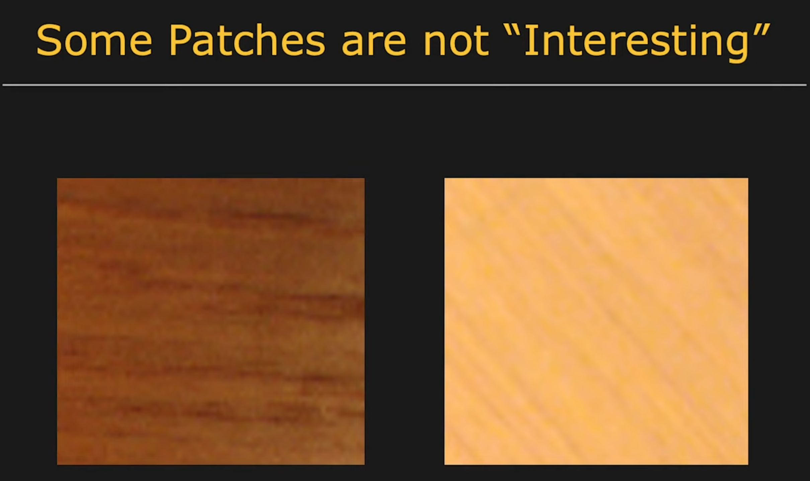

# Fundamentals

## What is Image Stitching

- Image stitching is a fascinating technique that combines multiple images to create a seamless panoramic image.
- This technique involves **aligning and blending** the images to create a seamless and high-resolution composite.

Key steps include:

1. Image Acquisition: Capture multiple images of the scene with overlapping areas. These images are usually taken with a **consistent orientation and similar exposure settings**.

2. Feature Detection: Identify distinctive features (like corners, edges, or specific patterns) in each image. Common algorithms for this task include **SIFT (Scale-Invariant Feature Transform), SURF (Speeded-Up Robust Features), and ORB (Oriented FAST and Rotated BRIEF)**.

3. Feature Matching: **Corresponding features between overlapping images are matched**. This step aligns the images by finding pairs of similar features.

4. Homography Estimation: Compute a transformation matrix (homography) that **aligns one image with the next**. This matrix describes how to warp one image to match the perspective of another.

5. Image Warping and Alignment: Apply the homography matrix to **warp images into a common coordinate frame** so that they overlap correctly.

6. Blending: Seamlessly **blend the overlapping areas** to reduce visible seams and ensure a smooth transition between images. Techniques like feathering, multi-band blending, and exposure compensation are often used.

7. Rendering: Combine the aligned and blended images into a single panoramic image. This may involve cropping to remove unwanted edges and adjusting the final image's exposure and color balance.

## Explaining Each Part

## SIFT (Scale-Invariant Feature Transform (SIFT))
> [!INFO] [video playlist here](https://www.youtube.com/watch?v=KgsHoJYJ4S8&list=PLlCkKK04bmVlvCs-S-2DnGf08MY2Hdd0n)

- This is an algorithm that **identifies distinctive keypoints** (step 2), often "blobs", that remain **robust and consistent across varying scales, rotations, and lighting conditions**
    - Uses include object recognition, robotic mapping and navigation, image stitching, 3D modeling, gesture recognition, video tracking, individual identification of wildlife and match moving.
- What is an interest point?
    - It is usally determined as a "blob" with a local appearence within it.
- A lot of the algorithm here is based in **blob detection theory.**
    - Methods used to identify such elements can detect the determined blobs over multiple scales, positions and magnification
- Basically, with this we can create a **SIFT Detector**
- With a SIFT detector, we can detect the points of interest. However, to match interest points in two images you need a signature that descriptes the local appearence, and that is when we need to have a **SIFT Descriptor**.

## What is an Interest Point?
- **In simple terms** (as said before): It is usally determined as a "blob" with a local appearence within it.
- **In a formal way**: a 2D position that has a well-defined, mathematically computable representation, and possesses distinct, rich local information.
    - It is basically and element of the image that clearly distinguish it from more "generic" or similar objects and can be used as referecence
- Even after determing this element, we still have to be able to identify it in different settings/use cases
    - With that, it is required that we remove some sources of variation
    - Example: Scale, orientation...
    - Ligthness need to be a more insenstive case
- And remember:

### What is an interest point composed of?
- Has rich image content (brightness variation, color variation...) so that it is "unique"
- Has well-defined representation (signature)
    - We can create a fingerprint of the point. This describes:
    - brightness patterns
    - edges
    - textures
    - gradients
- Has a well-defined position
    - Sharp corners to determine an exact location
    - Blurry regions are bad for example
- Invariant to image rotation and scaling
    - Even if we rotate, zoom in/out or magnify the image, still can be easily recognized
- Insensitive to lighting changes
    - The object should be recognizable in sunlight, indoors or even in slightly darker/brighter scenes
- A blob-like feature covers a lot of this caractheristics
- When we locate the blob, we need to determine its size
    - It is a roughly determined area that "embraces" the blob
- We also need to determine the orientation of the blob
- Format the signature that is independent of size and orientation

## Gausian Filter for Edge Detection
- Gaussian filters and derivatives are fundamental tools in image processing
- Typically used together to detect **features like edges while managing image noise**.

### Denoising and Smoothing - Gausian Filters
- A Gaussian filter is a low-pass filter used as a preprocessing step to reduce noise and blur fine details.
    - **Low-pass filter**: The filter that preserves smooth variations and remove harsh details. It basically preservers the most important and natural features of the image while tunning higher frequences (fine detail, noise, contrats, textures...) down to make it more natural and approachable.
    - **Mechanism**: It performs a weighted average where pixels closer to the center have more influence, modeled by a bell-shaped Gaussian distribution.
    - **Purpose**: Because derivatives (the next step) are highly sensitive to pixel fluctuations, Gaussian smoothing prevents tiny noise spikes from being wrongly detected as edges.
- Example:
    - Imagine a very grainy photo:
        - No filter → sharp image, but with noise.
        - With low-pass → smoother/blurrier image.
        - It’s basically a blurring effect.

### Detecting Change - Image Derivatives:
- Derivatives quantify the rate of change in pixel intensity across an image
- First Derivative (Gradient): Measures the slope of intensity changes. High gradient magnitudes indicate sudden transitions, which are usually edges. Common operators like the Sobel Operator use first-order derivative approximations.
- Second Derivative: Used to find zero-crossings, which precisely mark the center of an edge. The Laplacian operator is a common second-order filter.
